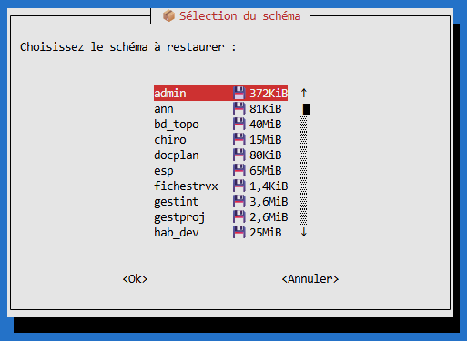
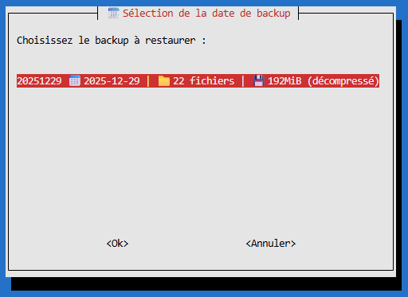
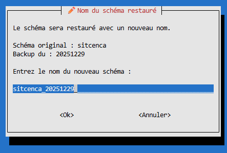
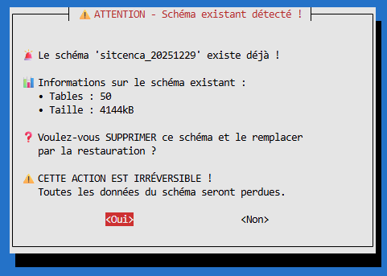
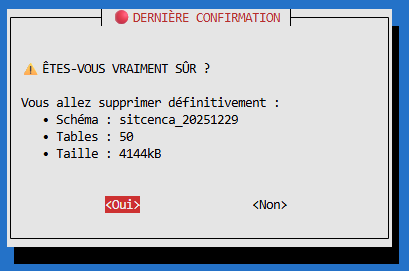

# 🐘 Backup/Restore PostgreSQL - Scripts de sauvegarde et restauration par schémas distincts

Scripts Bash de sauvegarde et de restauration de bases PostgreSQL avec gestion fine des schémas.

> ⚠️ **AVERTISSEMENT**
>
> Ce logiciel est fourni « tel quel », sans aucune garantie, expresse ou implicite.
> En aucun cas l'auteur ne pourra être tenu responsable de tout dommage, direct ou indirect,
> résultant de l'utilisation de ce logiciel, y compris mais sans s'y limiter, la perte de données.
>
> **L'utilisateur assume l'entière responsabilité de l'utilisation de ces scripts.**
> Testez toujours sur un environnement de développement avant toute utilisation en production.

## 📋 Fonctionnalités

- ✅ Sauvegarde sélective par schémas (pas besoin des droits admin)
- ✅ Compression automatique en `.gz`
- ✅ 3 modes de sauvegarde : `often`, `occasionally`, `tous`
- ✅ Système de logs complet dans `/var/log/backup_bdd/`
- ✅ Rotation automatique des backups avec rétention intelligente
- ✅ Gestion sécurisée des credentials via fichier `.env`

- ✅ Restauration de schéma. Un menu interractif vous aide à restauer un schéma précedement sauvegardé.


## 🚀 Installation

### 1. Cloner le dépôt
```bash
git clone https://github.com/themaire/backup_bdd_postgres.git
cd backup_bdd
```

### 2. Configurer les credentials
```bash
cp .env.example .env
nano .env  # Éditer avec vos informations de connexion ET votre chemin de sauvegarde
```

### 3. Rendre le script exécutable
```bash
chmod +x backup_bdd.sh
```

## 📖 Utilisation

```bash
./backup_bdd.sh <mode>
```

### Modes disponibles

| Mode | Description | Fréquence conseillée |
|------|-------------|---------------------|
| `often` | Données métier importantes (22 schémas) | Quotidien |
| `occasionally` | Données moins critiques (14 schémas) | Hebdomadaire |
| `tous` | Tous les schémas (28 schémas) | Mensuel |

### Exemples
```bash
./backup_bdd.sh often         # Backup quotidien des données importantes
./backup_bdd.sh occasionally  # Backup des données secondaires
./backup_bdd.sh tous          # Backup complet de tous les schémas
```

## 📁 Structure des fichiers

```
backup_bdd/
├── backup_bdd.sh      # Script principal de sauvegarde
├── restore_bdd.sh     # Script interactif de restauration (ncurses)
├── .env               # Credentials (NON versionné)
├── .env.example       # Template des credentials
├── .gitignore         # Fichiers ignorés par Git
├── pictures/          # Captures d'écran pour la documentation
│   └── restaure_menu_1.png
└── README.md          # Cette documentation
```

## 📂 Emplacements

| Type | Chemin |
|------|--------|
| Backups | `chemin_definit_dans_le_fichier_.env/YYYYMMDD/` |
| Logs | `/var/log/backup_bdd/backup_bdd.log` |

## 🔄 Politique de rétention

Le script nettoie automatiquement les anciens backups selon cette stratégie :

| Âge du backup | Rétention |
|---------------|-----------|
| < 7 jours | Tout conserver |
| 7-30 jours | 1 par semaine (dimanche) |
| 1-3 mois | 1 par mois (1er du mois) |
| 3-12 mois | 1 par mois (1er du mois) |
| > 12 mois | Supprimé |

Cela permet de conserver environ **21 backups** sur une année :
- 7 backups récents (dernière semaine)
- 3-4 backups hebdomadaires (dimanches du mois passé)
- ~11 backups mensuels (1er de chaque mois sur 12 mois)

## ⏰ Automatisation (Cron)

Pour automatiser les backups, ajouter dans crontab (`crontab -e`) :

```bash
# Backup quotidien à 2h du matin (données importantes)
0 2 * * * /chemin/vers/backup_bdd.sh often

# Backup hebdomadaire le dimanche à 3h (données secondaires)
0 3 * * 0 /chemin/vers/backup_bdd.sh occasionally

# Backup mensuel le 1er à 4h (tout)
0 4 1 * * /chemin/vers/backup_bdd.sh tous
```

## 📊 Format des logs

```
[2025-12-29 10:30:00] [INFO] Démarrage du script de backup
[2025-12-29 10:30:01] [SUCCESS] Schema 'admin' sauvegardé avec succès : sch_admin.sql.gz
[2025-12-29 10:30:15] [ERROR] Schema 'test' - Fichier de backup vide ou inexistant
[2025-12-29 10:30:20] [INFO] Backup terminé - Succès: 22, Erreurs: 1
```

## 🔄 Restauration d'un schéma

Le script `restore_bdd.sh` offre une **interface interactive conviviale** (ncurses/whiptail) pour restaurer un schéma depuis un backup.

### Lancement
```bash
./restore_bdd.sh
```

### Interface de sélection

Le script scanne automatiquement le dossier de backup et affiche un menu interactif listant tous les backups disponibles avec leurs dates et tailles :







### Fonctionnalités
- 🎯 Interface ncurses intuitive avec navigation au clavier
- 📅 Liste automatique des backups disponibles (avec date formatée et taille)
- 📦 Sélection du schéma à restaurer (avec taille décompressée affichée)
- ✏️  Renommage automatique avec suffixe de date (ex: `sitcenca` → `sitcenca_20251225`)
- 🔍 Détection de schéma existant avec affichage des statistiques (tables, taille)
- ⚠️  Double confirmation avant écrasement d'un schéma existant
- 💡 Proposition de renommage si le schéma cible existe déjà
- 📊 Affichage détaillé de la progression table par table

### Processus de restauration
```
╔════════════════════════════════════════════════════════════╗
║     🐘 RESTAURATION PostgreSQL - Interface Interactive     ║
╚════════════════════════════════════════════════════════════╝

[1/5] 📦 Décompression du backup...
      ✓ Décompression terminée
[2/5] ✏️  Renommage du schéma dans le fichier SQL...
      ✓ Renommage effectué
[3/5] 🧹 Nettoyage du fichier SQL...
      ✓ Nettoyage terminé
[4/5] 🆕 Création du schéma 'sitcenca_20251225'...
      ✓ Schéma créé
[5/5] 📥 Restauration des données...
      [2025-12-25 14:32:01] ✓ Table sites                  |    156 lignes
      [2025-12-25 14:32:02] ✓ Table parcelles              |   1842 lignes
      ...

╔════════════════════════════════════════════════════════════╗
║         ✅ RESTAURATION TERMINÉE                           ║
╠════════════════════════════════════════════════════════════╣
║ Schéma créé      : sitcenca_20251225                       ║
║ Tables restaurées: 16                                       ║
╚════════════════════════════════════════════════════════════╝
```

### Gestion des schémas existants

Si le schéma cible existe déjà, le script affiche ses informations :
- Nombre de tables existantes
- Taille totale du schéma

Puis propose 3 options :
1. **Écraser** : Supprime le schéma existant et restaure (double confirmation requise)
2. **Renommer** : Choisir un autre nom pour la restauration
3. **Annuler** : Abandonner la restauration

### Dépendance
```bash
sudo apt install whiptail  # Interface ncurses (souvent déjà installé)
```

## 🔧 Configuration avancée

### Modifier la rétention

> 🧙 **"Si ça marche, n'y touche pas !"** — Les valeurs par défaut ont été soigneusement calibrées pour offrir un bon équilibre entre sécurité des données et espace disque. Modifiez-les uniquement si vous savez ce que vous faites.

Si vous souhaitez tout de même ajuster la politique de rétention, éditez ces variables dans le fichier `.env` :

```bash
RETENTION_DAYS_FULL=7        # Période "tout garder" (défaut: 7 jours)
RETENTION_DAYS_WEEKLY=30     # Période "1 par semaine" (défaut: 30 jours)
RETENTION_DAYS_MONTHLY=90    # Période "1 par mois" (défaut: 90 jours)
RETENTION_DAYS_YEARLY=365    # Durée max avant suppression (défaut: 365 jours)
```

### Ajouter/Modifier des schémas

Éditer les listes dans le fichier `.env` :
```bash
SCHEMAS_TOUS="schema1 schema2 ..."
SCHEMAS_OFTEN="schema1 schema2 ..."
SCHEMAS_OCCASIONALLY="schema3 schema4 ..."
```

## 🛡️ Sécurité

- Les credentials sont stockés dans `.env` (non versionné)
- Le fichier `.env` doit avoir des permissions restrictives : `chmod 600 .env`
- Ne jamais commiter le fichier `.env` sur Git

## 📝 Licence

MIT - Libre d'utilisation et de modification.

## 👤 Auteur
Nicolas ELIE - 
CEN Champagne-Ardenne
